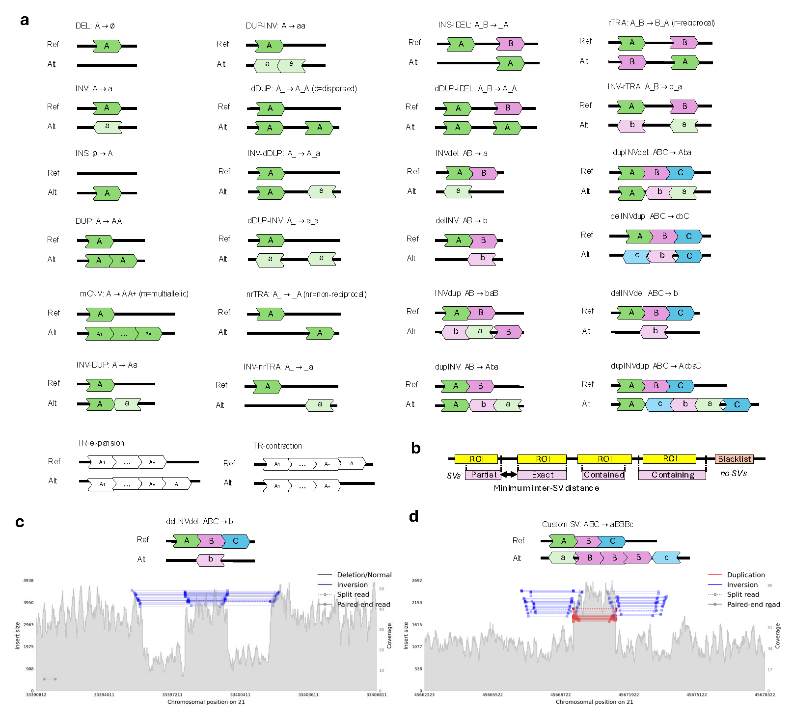

# insilicoSV: grammar-based structural variant simulation and placement

##### Table of Contents
[Overview](#overview)  
[Installation](#install)  
[User Guide](#guide)  
&nbsp;&nbsp; [Quick start](#start)  
&nbsp;&nbsp; [Recommended workflows](#workflow)  
&nbsp;&nbsp; [Detailed documentation](#docs)  

<a name="overview"></a>
## Overview

```insilicoSV``` is a versatile framework for structural variant (SV) simulation, 
which models SVs using a simple and flexible grammar, allowing users to define standard and custom genome 
rearrangements, as well as encode genome placement constraints.

Key features:

* Built-in support for 26 types of structural variants (simple and complex), small indels, and SNPs
* Custom SV simulation using grammatical SV notation (e.g. ```ABC -> aBBBc```)
* Fine-grained genome placement control allowing SVs (or specific SV breakpoints) to be constrained to specific regions 
of interest (with multiple placement modes available to specify how the SV should overlap with each region) or to avoid 
specific regions (i.e. category-specific blacklists)
* Integration of user-provided SVs
* Fine-grained size simulation allowing independent configuration of inter-breakpoint distances in complex SVs
* Modular SV definitions allowing any number of different SV categories to be defined and simulated in the same genome 
by combining a variety of attributes (e.g, type, size, placement constraints)
* Customizable WDL pipeline with support for genome simulation, read simulation, alignment, and visualization

Illustration of SV classes predefined in ```insilicoSV``` and their grammatical notation (a), 
supported SV placement constraints (b), Samplot visualization of short-read alignments at the site of a simulated 
complex delINVdel event (c), Samplot visualization of short-read alignments at the site of a simulated 
grammatically-specified custom SV event (d):



<a name="install"></a>
## Installation

Prerequisite: Python 3.9+ - [Install](https://www.python.org/downloads/)

* `$> pip install .`

<a name="guide"></a>
## User guide

<a name="start"></a>
### Quick start

To run ```insilicoSV```: ```$> insilicosv -c <path/to/config.yaml>```

<a name="workflow"></a>
### Recommended workflows 

1. Create a new directory
2. Create a new YAML config file in this directory
3. Populate the YAML config file with the parameters specific to this experiment (see [Input guidelines](docs/inputs.md) and 
[Use Cases](docs/use_cases.md))
4. Run ```insilicoSV``` providing the path to the config file as input. ```insilicoSV``` will automatically create 
output files in the YAML file directory.

Two customizable WDL pipelines are also provided to automatically simulate synthetic genomes and reads 
and produce alignments for downstream analysis. Each pipeline can be configured to (1) simulate one or multiple genomes, 
(2) simulate a single or multiple read datasets (currently supported platforms: Illumina, PacBio, and ONT) 
from these genomes, (4) align the reads, and (5) visualize the alignments at the simulated SV sites. 
See [WDL](docs/wdl.md) for more information.


<a name="docs"></a>
### Documentation
For detailed information about ```insilicoSV``` features, along with usage examples, 
please refer to the following documentation sections:
<!-- toc -->
- [SV Grammar](docs/sv_grammar.md)
- [Input guidelines](docs/inputs.md)
- [Use Cases](docs/use_cases.md)
- [Outputs](docs/outputs.md)
- [SV gallery](docs/sv_gallery.md)
- [WDL workflow](docs/wdl.md)
- [Notebook tutorial](workflows/insilicosv_demo.ipynb)


## Authors

Nick Jiang - nickj@berkeley.edu

Chris Rohlicek - crohlice@broadinstitute.org

Ilya Shlyakhter - ilya@broadinstitute.org

Enzo Battistella - ebattist@broadinstitute.org

Victoria Popic - vpopic@broadinstitute.org
