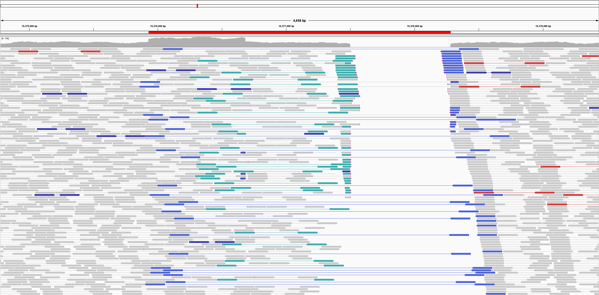
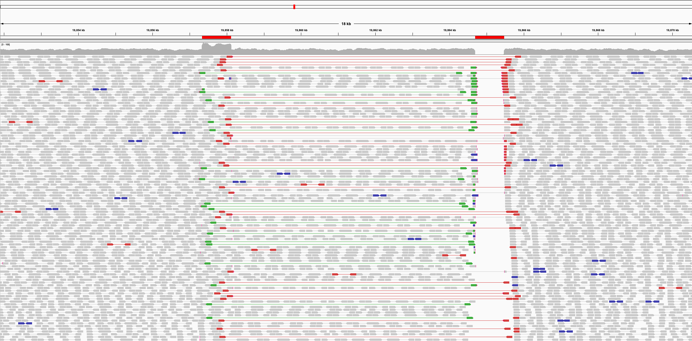

# insilicoSV
insilicoSV is a software to design and simulate simple and complex structural variants, both novel and known. 

## Requirements  (Prerequisites)
* Python 3.6 and up - [Install](https://www.python.org/downloads/)

## Installation

`$ pip install -r requirements.txt`

## To Run
```
samtools faidx <ref.fna>   # if index file already produced, skip this line
python simulate.py <ref.fna> <par.yaml> <prefix>
```

## Usage

insilicoSV takes in two input files: the reference genome and a yaml configuration file. Following the simulation, it outputs two haplotype files, a BEDPE file, and a simple stats file using the prefix given. 

Note: not all SVs inputted may be simulated. Because the simulator randomly selects positions for SVs, a SV may fail to be placed due to oversaturation. 

### Reference Genome
This file should be in FASTA format.

### Parameter File
The configuration yaml file specifies the range of the lengths of the SVs along with the number to simulate. All configurations for structural variants should be put under the "SVs" key. For each SV, the following parameters are available:
1. *type*: str, insilicoSV supports a predefined list of SVs and allows users to enter a custom transformation. Either "Custom" or one of the 16 predefined SV types named in the below table should be entered.
2. *number*: int, describes how many of the specified SV type to simulate
3. *min_length*: int or list, if an integer is provided, insilcoSV assumes that each event's length within a SV must fall between the min_length and max_length. Entering a list offers customization by specifying a different range for each event. If provided a list, insilicoSV assumes lengths are entered to correspond with the symbols in lexicographical order. The lengths for non-dispersion events (represented by alphabetical characters) will therefore be considered before that of dispersions (_). See usage example #2. 
4. *max_length*: int or list, must be the same type as min_length, note that max_length >= min_length >= 0 for all elements in each
5. *source=None [optional]*: Source sequence for a custom SV, see below to find instructions on how to create a transformation
6. *target=None [optional]*: Target sequence for a custom SV, see below to find instructions on how to create a transformation

The following optional parameters can be set under the "sim_settings" key to change default configurations for the simulator:
1. *max_tries=100 [optional]*: number of tries to find a valid position to simulate each SV
2. *fail_if_placement_issues=False [optional]*: if set to True, insilicoSV will raise an Exception when a single SV fails to be placed and simulated
3. *generate_log_file=False [optional]*: if set to True, insilicoSV will generate a log file for diagnostic purposes and debugging
4. *filter_small_chr=True [optional]*: filter out chromosomes too small for a SV to be placed, speeds up the process for simulation
5. *prioritize_top=False [optional]*: if set to True, simulate the SVs listed first as the later ones may fail to be placed. Otherwise, give each SV an equal chance to be simulated

Please see the table and picture for the list of predefined classes.


Source: Collins, R.L., Brand, H., Karczewski, K.J. *et al.* *Nature* (2020)

| SV Type | Transformation |
|---------|----------------|
| INS | "" -> "A" | 
| DEL | "A" -> "" |
| INV | "A" -> "a" |
| DUP | "A" -> "AA'" |
| TRA | "A_" -> "_A" | 
| dupINVdup | "ABC" -> "Ac'ba'C" |
| delINVdel | "ABC" -> "b" |
| delINVdup | "ABC" -> "c'bC" |
| dupINVdel | "ABC" -> "Aba'" |
| delINV | "AB" -> "b" |
| INVdel | "AB" -> "a" |
| dDUP-iDEL | "A_B" -> "A_A'" |
| INS-iDEL | "A_B" -> "_A" |
| dup_INV | "AB" -> "Aba'" |
| INV_dup | "AB" -> "b'aB" |
| INVdup | "A" -> "aa'" |
| dDUP | "A_" -> "A_A'" |
| INV_dDUP | "A_" -> "A_a'" |
| div_dDUP | "A_" -> "A_A*" |

A custom SV consists of a user-generated transformation with a source and target sequence of "symbols," most of which are alphabetical letters. Some examples of a source would be "ABC" and "A_B_C," while some examples of the target would be "a'AB" or "A_b'Bc'_C." 

insilicoSV maps a random fragment of the reference to each of the symbols in the source and recompiles the affected region with the target. For instance, "AB -> "A" would remove the fragment marked as symbol B. All symbols in the source sequence MUST be unique to create a one-to-one mapping between symbol and reference fragment.

| Name | Symbol | Description |
|------|--------|-------------|
| Generic Event | Any uppercase alphabetical letter (etc. "A") | The most fundamental organizing tool that maps to a reference fragment |
| Inversion | Any lowercase alphabetical letter | Indicates an inversion. <br /> Ex. a transformation "ABC" -> "abc" will invert "A," "B", and "C" and organize the new fragments as denoted in the target |
| Duplication | Original symbol followed by single quotation (') | An original symbol refers to the initial character used in the source sequence. *There can only be ONE original symbol for every unique character - all other copies, including those that are inverted, must have a duplication "'" marking.* <br /> Ex. A transformation "ABC" -> "ABA'c" would duplicate "A" after "B" and invert the fragment C.|
| Dispersion | Underscore (_) | Indicates a gap between the symbols surrounding it. Note that events may be simulated within a dispersion but not within other events. |
| Insertions | Uppercase alphabetical letter | To add foreign, randomly-generated insertions, use a symbol not present in the source to the target sequence. <br /> Ex. "A_B" -> "A_BC" inserts a randomly-generated sequence after the fragment indicated by symbol "B"|


### BEDPE File

Each line/entry will have the following parameters:
1. *source_chr*: The source chromosome of the event
2. *source_start*: Start position on the source_chr [INCLUDE at pos], zero-based indexing
3. *source_end*: End position on the source_chr [EXCLUDE at pos], one-based indexing
4. *target_chr*: The target chromosome of the event
5. *target_start*: Start position on the target chr [INCLUDE at pos], zero-based indexing
6. *target_end*: End position on the target chr [EXCLUDE at pos], one-based indexing
7. *event_type*: Describes the transformation made by the event, either an INS, DEL, INV, TRA, DUP, INVDUP, or INVTRA. Dispersed duplications--those that do not occur immediately after the original--have an attached "d" at the front.
8. *event_size*: Size of the reference fragment impacted by the event
9. *zygosity*: 0/1 = heterozygous, 1/1 = homozygous. insilicoSV gives each SV a 2/3 chance of being heterozygous and 1/3 chance of being homozygous. 
10. *parent_sv*: Describes the parent SV the event is a component of, for instance "dupINVdup." If a custom SV was provided, the name becomes "source>target"
11. *nth_sv*: int, index to count up each SV (note: not the events). All events of a SV belong in the same index.
12. *order*: int, for insertion-like operations such as TRA, INS, or DUP, the "order" index describes in which order events that target the same position were compiled. Events with INV and DEL operations have an order of 0.

## Usage examples
### Example 1 - Predefined SVs
```yaml
# YAML config file
sim_settings:
    max_tries: 200
    prioritize_top: True
SVs:
    - type: "INS"
      number: 10
      min_length: 5
      max_length: 10
    - type: "INVdel"
      number: 2
      min_length: 5
      max_length: 10
    - type: "dupINVdel"
      number: 1
      min_length:
        - 5
        - 10
        - 5
      max_length:
        - 10
        - 15
        - 10
```
```
# BEDPE file
Chromosome21	148	149 Chromosome21	148	149	INS	10	  0/1	INS	        1	  1
Chromosome19	5	  6	  Chromosome19	5	  6	  INS	6	    0/1	INS	        2	  1
Chromosome19	38	39	Chromosome19	38	39	INS	7	    1/1	INS	        3   1
Chromosome21	48	49	Chromosome21	48	49	INS	8	    1/1	INS	        4	  1
Chromosome19	86	87	Chromosome19	86	87	INS	10	  0/1	INS	        5	  1
Chromosome19	64	65	Chromosome19	64	65	INS	9	    1/1	INS	        6	  1
Chromosome19	7	  8	  Chromosome19	7	  8	  INS	10	  0/1	INS	        7	  1
Chromosome21	141	142	Chromosome21	141	142	INS	8	    1/1	INS	        8	  1
Chromosome19	74	75	Chromosome19	74	75	INS	10	  1/1	INS	        9	  1
Chromosome19	60	61	Chromosome19	60	61	INS	7	    0/1	INS	        10  1
Chromosome21	23	31	Chromosome21	23	31	INV	7	    0/1	INVdel	    11	0
Chromosome21	30	36	Chromosome21	30	31	DEL	5	    0/1	INVdel	    11	0
Chromosome21	122	132	Chromosome21	122	132	INV	9	    1/1	INVdel	    12	0
Chromosome21	131	142	Chromosome21	131	132	DEL	10	  1/1	INVdel	    12	0
Chromosome19	93	106	Chromosome19	93	106	INV	12	  0/1	dupINVdel	  13	0
Chromosome19	88	94	Chromosome19	105	106	INVDUP	5	0/1	dupINVdel	  13	1
Chromosome19	105	113	Chromosome19	105	106	DEL	7	    0/1	dupINVdel	  13	0
```
### *Example 1a* - Example config with entire insilicoSV vocabulary
This [gist](https://gist.github.com/crohlicek/9d529e600508870b1424d1f41215acb8) contains an example config file specifying the subevent size ranges for each event.


### Example 2 - Custom SVs
```yaml
# YAML config file
SVs:
    - type: "Custom"
      source: AB_C_D
      target: bb'_AEc'_EDC
      number: 1
      min_length: 
        - 5   # A
        - 6   # B
        - 7   # C
        - 8   # D
        - 10  # E
        - 10  # first _
        - 15  # second _
      max_length: 
        - 10
        - 10
        - 10
        - 10
        - 15
        - 15
        - 20
```
```
# BEDPE file
Chromosome21	100	110	Chromosome21	100	110	INV	    9	  0/1	AB_C_D>bb'_AEc'_EDC	1	0
Chromosome21	100	110	Chromosome21	109	110	INVDUP	9	  0/1	AB_C_D>bb'_AEc'_EDC	1	1
Chromosome21	92	101	Chromosome21	124	125	TRA	    8	  0/1	AB_C_D>bb'_AEc'_EDC	1	1   # order important for insertion-like operations at the same position
Chromosome21	124	125	Chromosome21	124	125	INS	    14	0/1	AB_C_D>bb'_AEc'_EDC	1	2
Chromosome21	124	135	Chromosome21	124	125	INVDUP	10	0/1	AB_C_D>bb'_AEc'_EDC	1	3
Chromosome21	150	151	Chromosome21	150	151	INS	    14	0/1	AB_C_D>bb'_AEc'_EDC	1	1
Chromosome21	124	135	Chromosome21	159	160	TRA	    10	0/1	AB_C_D>bb'_AEc'_EDC	1	1
```

### Example 3 - Editing reference with input SVs
To edit an input reference file with a known set of SVs the user can provide a VCF file containing the SVs in the yaml 
of format shown above. The events in the VCF must be non-overlapping. Supported variant types for this use case 
currently include DEL, DUP, INV, INS, dDUP, INV_dDUP, and TRA. For insertions, events may be specified with the insertion
sequence given in an INFO field called `INSSEQ` (provided a matching header line is included as well). The commandline 
call to perform this reference edit is the same as the previous simulate.py call given above:
```yaml
# YAML config file
SVs:
    - vcf_path: {path_to_vcf}
```
```
python simulate.py <ref.fna> <par.yaml> <prefix>
```

### Example 4 - Placing events at known repetitive element intervals
To augment a randomized simulation of events onto an input reference, the user can include in the simulation config
file the path to a .bed file containing known element intervals (e.g., known repetitive elements taken from RepeatMasker).
In addition to providing the path to the relevant .bed file(s), the user will also need to specify how many of each 
event type they wish to be placed at events from the .bed file. An example config with these inputs is:
```yaml
sim_settings:
    max_tries: 200
    prioritize_top: True
overlap_events:
    bed: '/{path_to}/{candidate_overlap_events}.bed'
SVs:
    - type: "DEL"
      number: 10
      min_length:
        - 5
      max_length:
        - 5
      num_overlap: 5
    - type: "DUP"
      number: 10
      min_length:
        - 5
      max_length:
        - 5
      num_overlap: 2
```
Multiple .bed files can be given as input and their records will be combined and drawn from during event placement (in this
case the user should provide a list of paths). Additionally, the user can provide a list of repetitive element types that
will be allowed for event placement during simulation (.bed records of all other types being ignored). An example entry
with multiple .bed files and specified allowed types is:
```yaml
overlap_events:
    bed: ['/{path_to}/{candidate_overlap_events_1}.bed','/{path_to}/{candidate_overlap_events_2}.bed']
    allow_types: ['L1HS', 'L1PA3']
```
While the simulator is placing each set of events, the first (`num_overlap`) events of that type will have their location
given by an event from the .bed file given in the `overlap_events` field that falls within the specified size range for 
that SV type. Events from the `overlap_events` .bed file(s) will be shuffled on input, and the file is required to have
the first four columns of standard .bed records (chrom, chromStart, chromEnd, name), and only contain events from chromosomes
included in the base reference used for the simulation.

The output .vcf file will label which events were placed at specified intervals with the additional INFO field
`OVERLAP_EV=True', as in this example record:
```
chr21   18870078    DEL N   DEL 100 PASS    END=18876908;SVTYPE=DEL;SVLEN=6831;OVERLAP_EV=True  GT  0/1
```
The current set of event types that are amenable to this feature are DEL, DUP, INV, dDUP, INV_dDUP, and TRA. For events
involving dispersions (dDUP, INV_dDUP, TRA) the position is assigned such that the source event of the SV (the component
getting duplicated or translocated) is placed at the selected element interval.

### Automated pipeline bash scripts
#### `generate_synthetic_genome.sh`
To automate the process of generating a synthetic reference and aligned BAM file, `generate_synthetic_genome.sh` can be run with inputs
giving the paths to the simulation config file, source reference fasta file, and output file prefix for the resulting files:
```
sh generate_synthetic_genome.sh {path_to}/simulation_config.yaml {path_to}/ref.fa {output_prefix}
```
The bash script will execute `simulate.py` so will require the environment created with `requirements.txt`, as well as
dwgsim, samtools, and bwa.

#### `divergent_repeat_augmentation.sh`
To generate a synthetic reference that includes divergent repeat events, `divergent_repeat_augmentation.sh` automates a
multi-staged simulation procedure by which a source reference is used to generate two edited references, in
which the first is augmented with events of the form "A_"->"A_A*", and the second is augmented with dispersed
duplications ("A_"->"A_A") in the same locations. This has the effect of modeling the situation in which the source reference
has repetitive sequences in which the instances of the repetition occur with scattered base flips, but the donor has the 
same repeats but without any base flips. In order to capture the read signal that identifies this phenomenon, reads are
drawn from the second reference (after any additional events have also been added) and aligned to the first. As with
`generate_synthetic_genome.sh`, `divergent_repeat_augmentation.sh` requires dwgsim, samtools, and bwa in addition to the packages given in 
`requirements.txt`.

The bash script requires as input the path to the source reference, paths to the simulation config files to be used for
the two edited references, the file prefix for the simulation's output files, and the config file describing any additional
event that are to be simulated in addition to the divergent repeats. An example call is:
```
sh divergent_repeat_augmentation.sh {path_to}/ref.fa {path_to}/div_repeat_R1.yaml {path_to}/div_repeat_R2.yaml {output_prefix} {path_to}/events.yaml
```
To ensure that the output files of each stage of the process get fed to the next correctly, the three config files must
include specific entries with the proper paths based on what output file prefix is given for the simulation. For example,
a config used to generate the first reference (`div_repeat_R1.yaml` in the example above) should specify div_dDUP as the
SV type:
```yaml
sim_settings:
    max_tries: 200
    prioritize_top: True
SVs:
    - type: "div_dDUP"
      number: 3
      min_length:
        - 500
        - 5000
      max_length:
        - 1000
        - 10000
```
The config used to generate the second reference (`div_repeat_R2.yaml` in the example) then must read in the .vcf generated
by the creation of the first reference in order to have knowledge of where the divergent repeats were placed:
```yaml
SVs:
    - vcf_path: "{path_to_simulation_directory}/{output_prefix}1.vcf"
```
And the config of additional events to be added will be of the normal form but with an entry giving the path to a .vcf
that will be created which specifies the intervals occupied by the divergent repeat events:
```yaml
sim_settings:
    max_tries: 200
    prioritize_top: True
SVs:
    - avoid_intervals: "{path_to_simulation_directory}/{output_prefix}1_decoy_divrepeat_intervals.vcf"
    - type: "DEL"
      number: 3
      min_length: 1000
      max_length: 10000
    - type: "DUP"
      number: 3
    ...
```
After the multi-staged simulation is complete, the alignments will be stored in `{output_prefix}.bwamem.sorted.bam`,
the reference to which they were aligned will be `{output_prefix}1.hapA.fa`, the intervals occupied by divergent repeats
will be stored in `{output_prefix}1_decoy_divrepeat_intervals.vcf`, and the simulated SV will be given in
`{output_prefix}2_EDIT.{vcf/bed}`.

### Example IGV visualizations
Below are IGV visualizations of the alignment signal under each event in insilicoSV's current library of named SV types.

**DEL: "A" -> " "**

**DUP: "A" -> "AA'"**

**INV: "A" -> "a"**

**INS: " " -> "A"**

**dDUP: "A\_" -> "A\_A'"**

**INV_dDUP: "A\_" -> "A\_a'"**

**TRA: "A\_" -> "\_A"**

**dupINVdup: "ABC" -> "Ac'ba'C"**

**dupINVdel: "ABC" -> "Aba'"**

**delINVdup: "ABC" -> "c'bC'"**

**delINVdel: "ABC" -> "b"**

**dDUP_iDEL: "A\_B" -> "A\_A'"**

**INS_iDEL: "A\_B" -> "\_A'"**

**INVdup: "A" -> "aa'"**

**dup_INV: "AB" -> "Aba'"**

**INV_dup: "AB" -> "b'aB"**

**delINV: "AB" -> "b"**

**INVdel: "AB" -> "a"**

**divergence: "A" -> "A\*"**

**divergent repeat**


## How to Contribute
Pull requests are welcome. For major changes, please open an issue first to discuss what you would like to change. Please make sure to update tests as appropriate. If you'd like to contribute, please fork the repository and make changes as you'd like.

Steps to contribute:
1. Fork this repository (link to your repository)
2. Create your feature branch (git checkout -b feature/insilicoSV)
3. Commit your changes (git commit -am 'Add some feature')
4. Push to the branch (git push origin feature/insilicoSV)
5. Create a new Pull Request

## Authors
Chris Rohlicek - crohlice@broadinstitute.org

Nick Jiang - nickj@berkeley.edu
