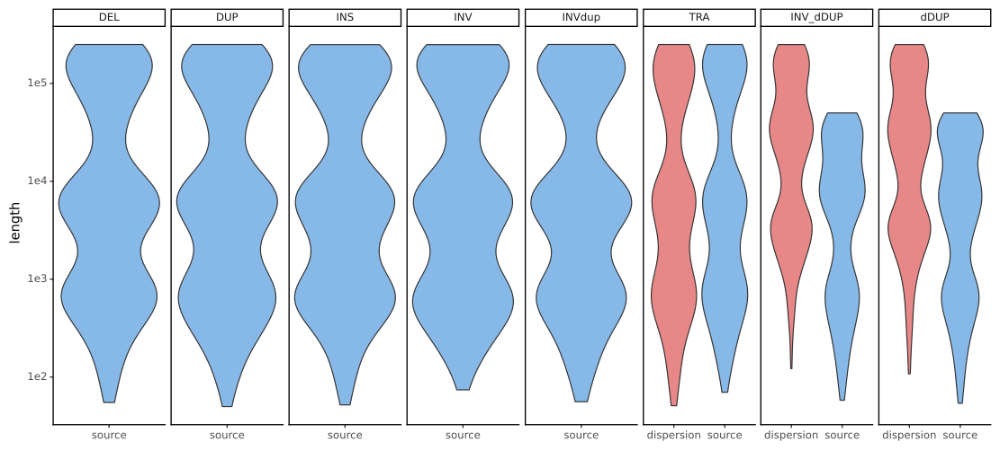
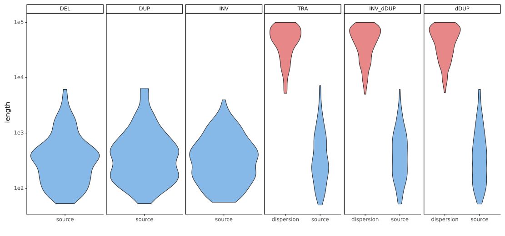

# Benchmark genomes

We provide here two synthetic genomes that can be used for benchmarking purposes. The first genome provides a context-free benchmark meant to provide a bias-free general-purpose survey set of simple and complex SVs across all primary chromosomes of GRCh38. The second genome provides a context-aware benchmark, with a set of simple and complex SVs places at the locations of randomly chosen L1 repetitive elements – the SV types included in this benchmark genome are those which have known associations with L1 elements.

# Context-free benchmark
This benchmark contains 750 deletions, duplications, inversions, insertions, inverted duplications, dispersed duplications, inverted  dispersed duplications, and translocations randomly placed across chromosomes 1 through 22 of GRCh38. Each SV type is simulated in three equal-sized groups with different length distributions meant to give the user the option to consider small (50bp - 1,000bp), medium (1,000bp - 10,000bp), or large (10,000bp – 250,000bp) variants separately or together. This benchmark is populated with equal quantities of each SV type explicitly to provide a fully balanced evaluation set that will be free from any biases of SV count, size, or location that might occur if one is using real data or synthetic data meant to mimic these aspects of real data. Evaluation on a balanced dataset is critical to identifying points of weakness of an SV analysis pipeline because performance metrics from a model that is tuned to a specific case of SV might be inflated if the evaluation set is overly representative of that case. This synthetic genome is meant to provide a general-purpose survey set of simple and complex variants with completely random placement.

Below we provide the links to the edited reference files as well as the `.vcf` and `.bed` files describing all of the groundtruth SV placement, as well as the type-specific SV length distributions.

- ***Links to datasets***

# Context-aware benchmark
The second synthetic genome provides a context-aware benchmark in which an equal number (200 each) of deletions, duplications, inversions, dispersed duplications, inverted dispersed duplications, and translocations are placed throughout chromosome 1 through 22 of GRCh38 at positions that overlap repetitive genome elements to which those types have a known association. The SV-element associations that are included in this benchmark are those between L1 elements and dispersion-based events and deletions, duplications, and inversions. In order to provide a similarly unbiased evaluation set to the context-free genome described above, insilicoSV sampled L1 elements randomly (limiting the selections to be those L1 intervals at least 50bp in length) to be used as the source interval locations for the various SVs included in the output genome.

Below we provide the links to the edited reference files as well as the `.vcf` and `.bed` files describing all of the groundtruth SV placement, as well as the type-specific SV length distributions.

- ***Links to datasets***
