# Example SV Visualizations

Below are IGV pileup images of each of the predefined SV types with short read alignment and pair orientation highlighted to demonstrate the alignment signatures manifested by each SV.

### DEL
A $&#8594 &#x2205$

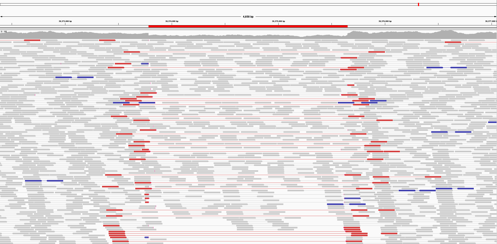

### DUP
A $&#8594$ AA'
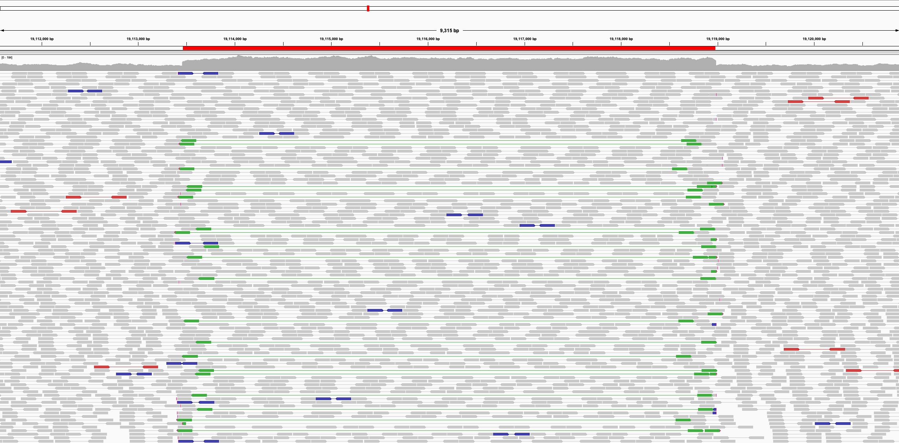
### INV
A $&#8594$ a
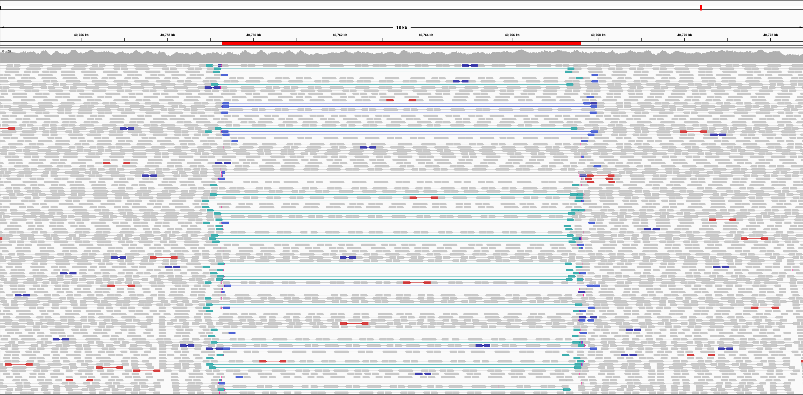
### INS
$&#x2205 &#8594$ A
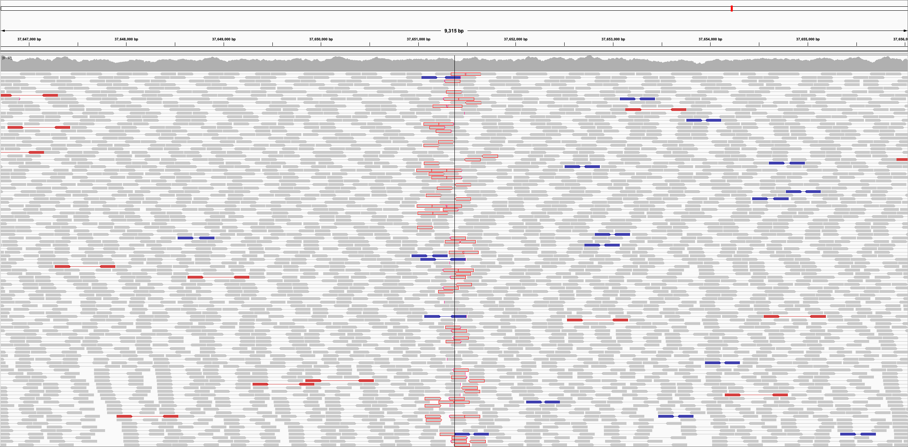
### dDUP
A\_ $&#8594$ A\_A'
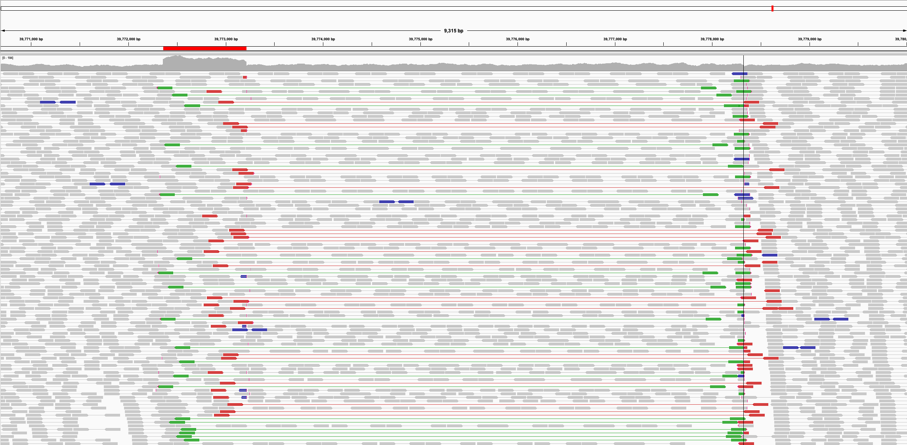
### INV_dDUP
A\_ $&#8594$ A\_a'
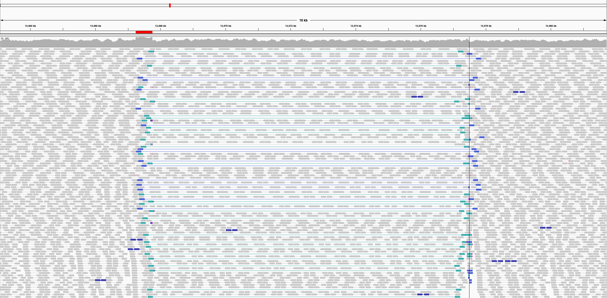
### TRA
A\_ $&#8594$ \_A

### dupINVdup
ABC $&#8594$ Ac'ba'C
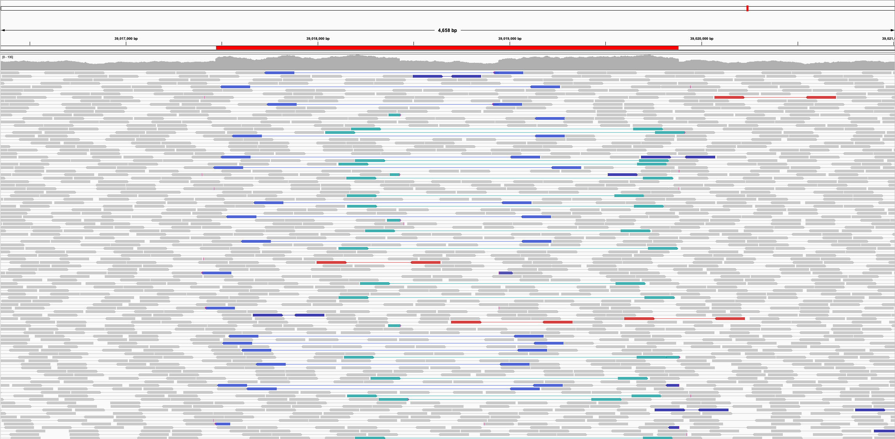
### dupINVdel
ABC $&#8594$ Aba'
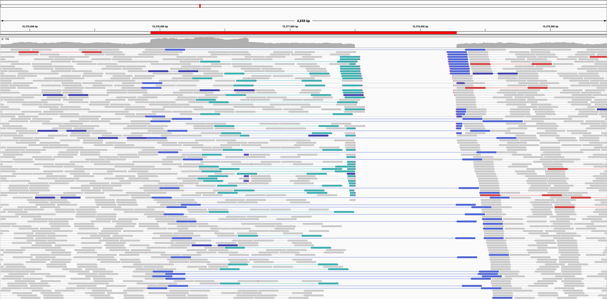
### delINVdup
ABC $&#8594$ c'bC'
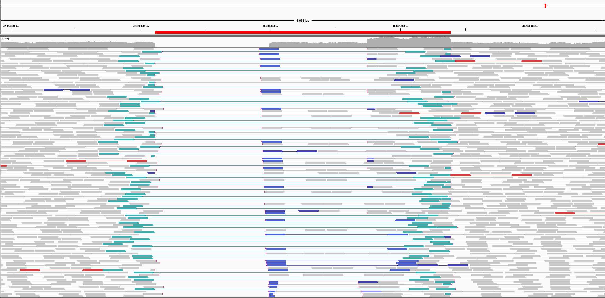
### delINVdel
ABC $&#8594$ b
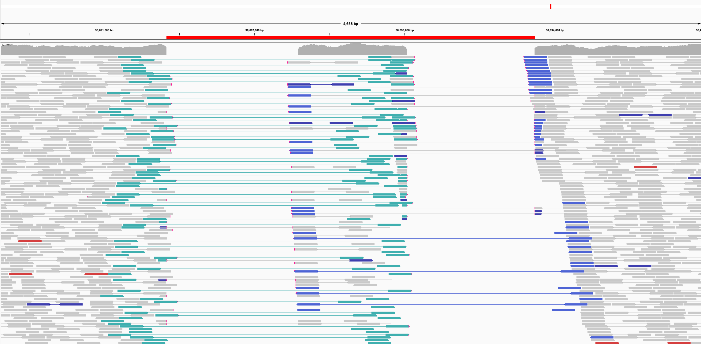
### dDUP_iDEL
A\_B $&#8594$ A\_A'
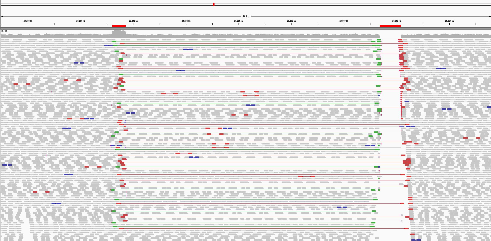
### INS_iDEL
A\_B $&#8594$ \_A'
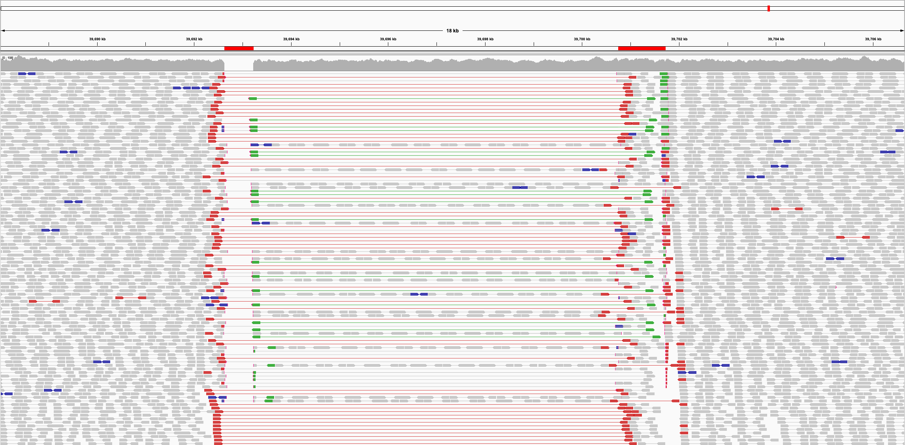
### INVdup
A $&#8594$ aa'

### dup_INV
AB $&#8594$ Aba'
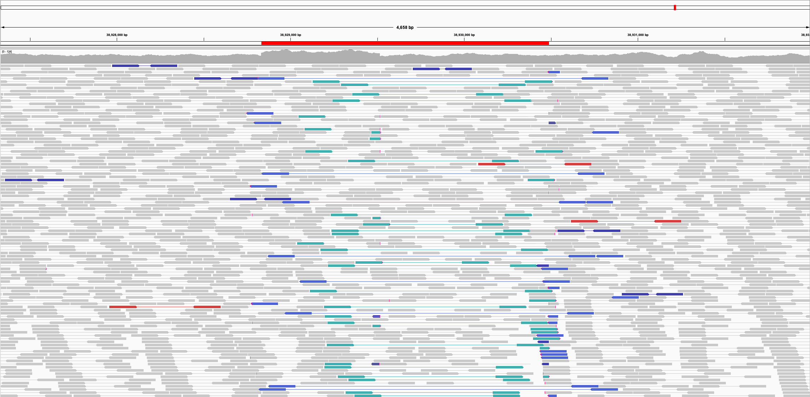
### INV_dup
AB $&#8594$ b'aB
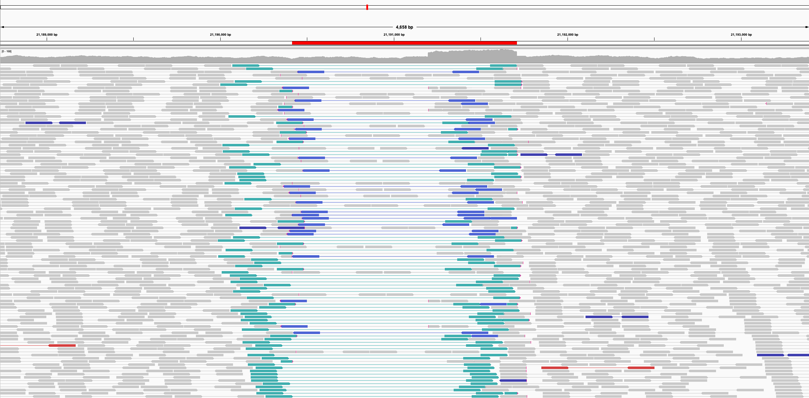
### delINV
AB $&#8594$ b
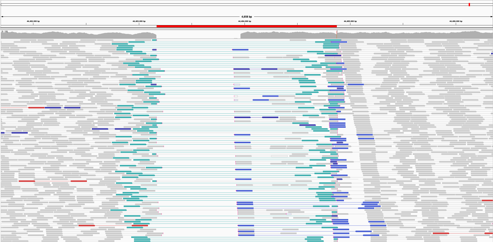
### INVdel
AB $&#8594$ a
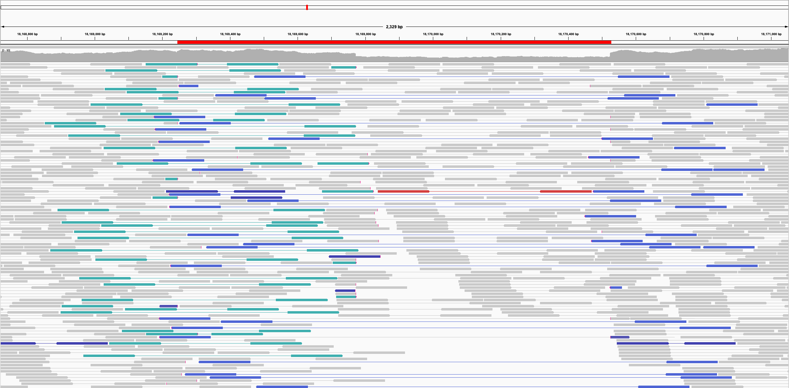
### divergence
A $&#8594$ A\*
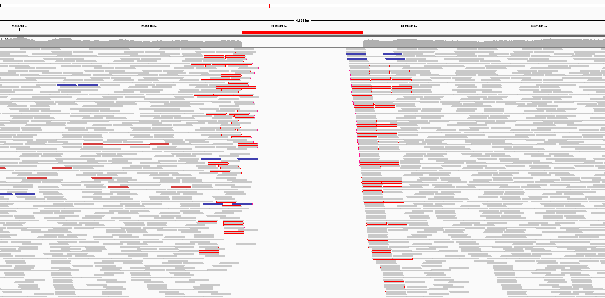
### divergent repeat
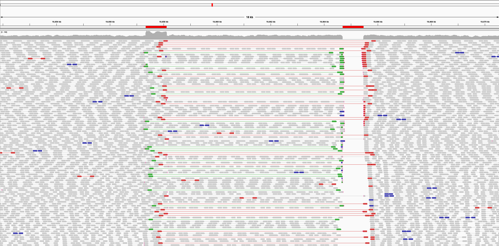
