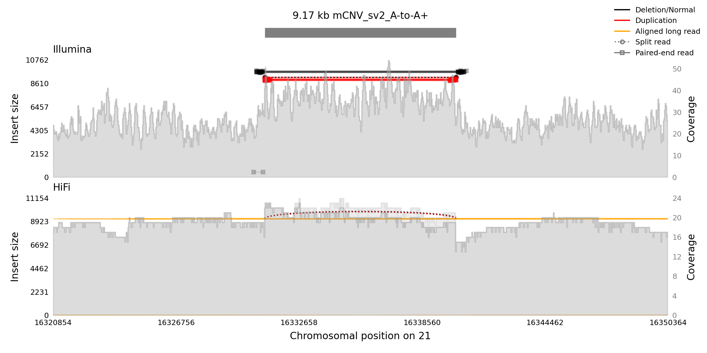
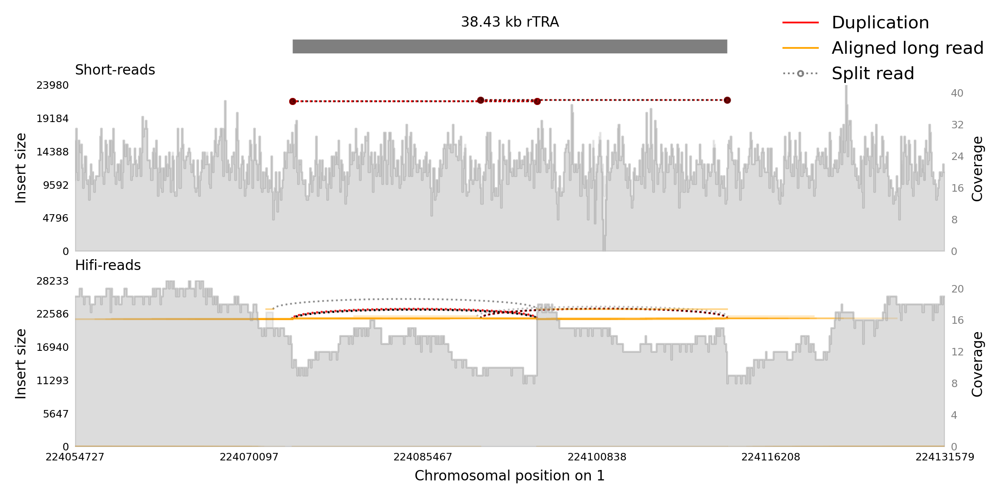
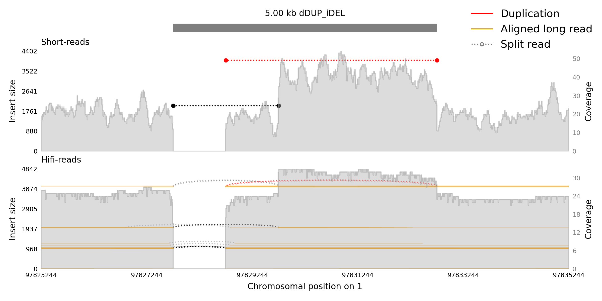
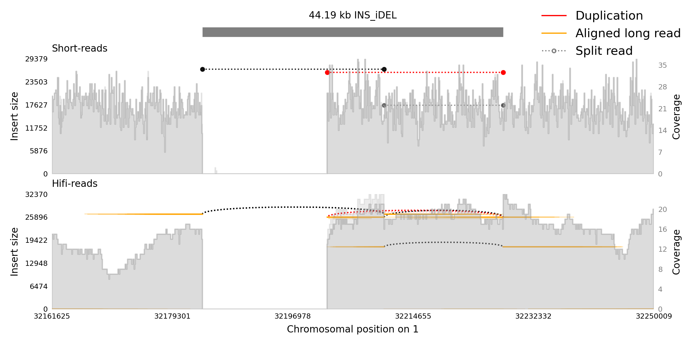
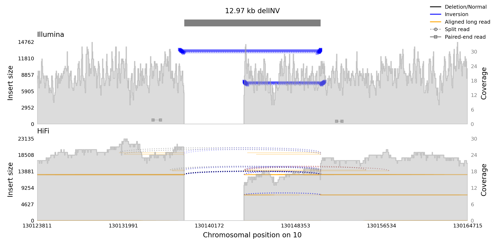
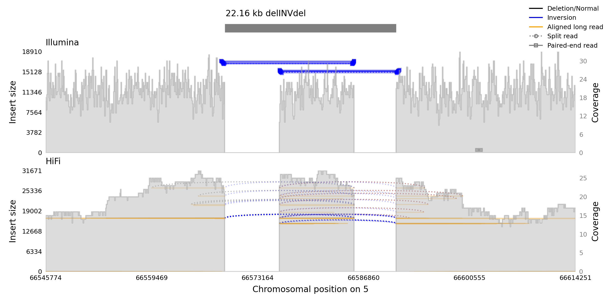
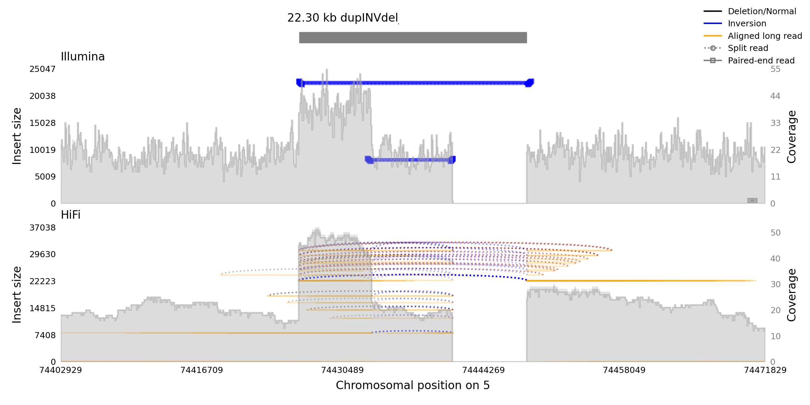
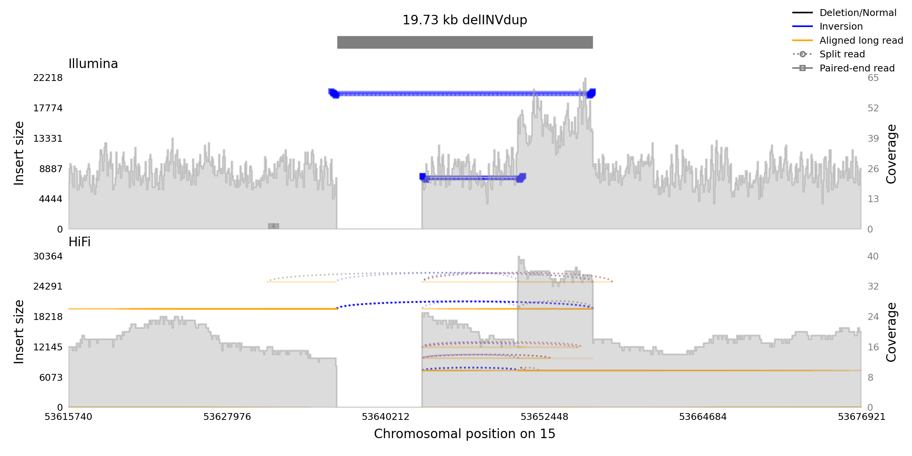

# Example SV Visualizations

Below are IGV pileup images of each of the predefined SV types with short read alignment and pair orientation highlighted 
to demonstrate the alignment signatures manifested by each SV.

### SNP

### INS
$\emptyset \rightarrow$ A

### DEL
A $\rightarrow \emptyset$

### DUP
A $\rightarrow$ AA+

### mCNV
A $\rightarrow$ A+

### INV\_DUP
A $\rightarrow$ Aa

### DUP\_INV
A $\rightarrow$ aa

### INV
A $\rightarrow$ a

### dDUP
A\_ $\rightarrow$ A\_A or \_A $\rightarrow$ A\_A

### INV\_dDUP
A\_ $\rightarrow$ A\_a or \_A $\rightarrow$ a\_A

### dDUP\_INV
A\_ $\rightarrow$ a\_a or \_A $\rightarrow$ a\_a

### nrTRA
A\_ $\rightarrow$ \_A or \_A $\rightarrow$ A\_

### rTRA
A\_B $\rightarrow$ B\_A or B\_A $\rightarrow$ A\_B

### dDUP_iDEL
A\_B $\rightarrow$ A\_A or B\_A $\rightarrow$ A\_A

### INS_iDEL
A\_B $\rightarrow$ \_A or B\_A $\rightarrow$ A\_

### dupINV
AB $\rightarrow$ Aba

### INVdup
AB $\rightarrow$ baB

### delINV
AB $\rightarrow$ b

### delINVdel
ABC $\rightarrow$ b

### dupINVdup
ABC $\rightarrow$ AcbaC

### dupINVdel
ABC $\rightarrow$ Aba

### delINVdup
ABC $\rightarrow$ cbC

### Tandem Repeat Examples
### trCON
The motif is contracted, the number of repetitions is reduced by a value in 'repeat_count_change_range'.

### trEXP
The motif is expanded, 'repeat_count_change_range' repetitions are added.

### Context Aware Examples
Provides examples of the impact of the different placement options on the SV signatures.
### Contained Overlap
The DEL is contained in an Alu region.

### Containing Overlap
The DEL contains a L1 region.

### Partial Overlap
One and only one of the DEL breakends is in an L1HS region.

### Exact Overlap
The DEL breakends delimit an Alu region.
