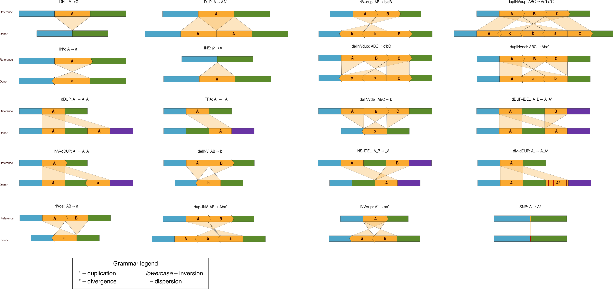

# SV Grammar

insilicoSV uses a grammatical notation to represent the various types of SVs that can be supported by the simulator. A graphical representation of the notation is given below:

The grammar represents unaltered reference intervals with capital letters and includes symbols to represent transformations of those intervals that appear in the output genome (see table below). For example, a deletion-flanked inversion (delINV) is notated as AB $&#8594$ b, in which the left side of the expression indicates the two reference intervals involved in the delINV and the right side indicates the donor sequence that will appear in place of AB, that is the inverted interval b. Although SNPs are not considered to be a type of structural variant, we include them here as another valid event type for simulation (see [use cases](example_use_cases.md#example-1b---example-snp-specification) for usage examples). This grammar may be used to specify custom SVs, as shown in [this example](https://github.com/PopicLab/insilicoSV-dev/blob/develop/docs/example_use_cases.md#example-2---custom-svs).

insilicoSV maps a random fragment of the reference to each of the symbols in the source and reconsiles the affected region with the target. For instance, AB $&#8594$ A would remove the fragment marked as symbol B. All symbols in the source sequence MUST be unique to create a one-to-one mapping between symbol and reference fragment.

| Name | Symbol | Description |
|------|--------|-------------|
| Generic Event | Any uppercase alphabetical letter | The most fundamental organizing tool that maps to a reference fragment |
| Inversion | Any lowercase alphabetical letter | Indicates an inversion.   Ex. a transformation ABC $&#8594$ abc will invert A, B, and C and organize the new fragments as denoted in the target |
| Duplication | Original symbol followed by single quotation (') | An original symbol refers to the initial character used in the source sequence. *There can only be ONE original symbol for every unique character - all other copies, including those that are inverted, must have a duplication marking (').*   Ex. A transformation ABC $&#8594$ ABA'c would duplicate A after B and invert the fragment C.|
| Dispersion | Underscore (_) | Indicates a gap between the symbols surrounding it. Note that events may be simulated within a dispersion but not within other events. |
| Divergence | Asterisk (\*) | Indicates an interval in which some proportion of bases are changed. |
| Insertions | Uppercase alphabetical letter | To add foreign, randomly-generated insertions, use a symbol not present in the source to the target sequence.   Ex. A_B $&#8594$ A_BC inserts a randomly-generated sequence after the fragment indicated by symbol B|
